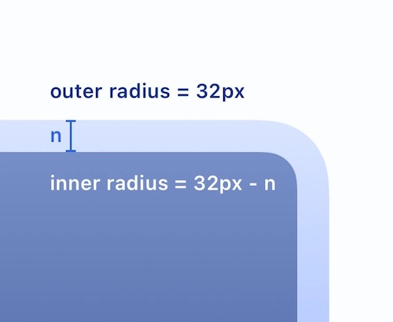
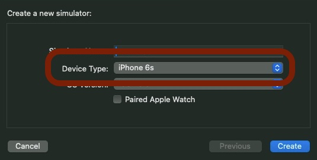

# DeviceBezel


## Overview

DeviceBezel is a Swift package designed to simplify the process of accessing device-specific bezel sizes in apps.

Knowing the exact bezel size can be crucial for aligning UI elements, creating immersive experiences, or when you need pixel-perfect design layouts.

By providing an easy-to-use API, `DeviceBezel` allows developers to focus more on their app's functionality rather than wrestling with device metrics.

## Compatibility

### Package

This package is built with Swift 5.4 and supports iPhone / iPad version `v11.0+`.

Please ensure that you are using the supported platform versions to avoid compatibility issues.

### Devices

In terms of the devices supported though, it covers from the initial versions of all devices. See the [device list](#device-list).

## Installation

### Swift Package Manager

The BezelKit package uses Swift Package Manager (SPM) for easy and convenient distribution. Follow these steps to add it to your project:

1. In Xcode, click `File -> Swift Packages -> Add Package Dependency`.
2. In the search bar, type `https://github.com/markbattistella/BezelKit` and click `Next`.
3. Specify the version you want to use. You can select the exact version, use the latest one, or set a version range, and then click `Next`.
4. Finally, select the target in which you want to use `BezelKit` and click `Finish`.

## Usage

As `BezelKit` provides public access to the extensions, there is no need to import the package into your files. You can access or set the fallback directly through `CGFloat`.

### General Usage

You can access the bezel size for the current device by using the `deviceBezel` static variable from the `CGFloat` extension:

```swift
let currentBezel = CGFloat.deviceBezel
print("Current device bezel: \(currentBezel)")
```

### Perfect Scaling

The `DeviceBezel` package not only provides an easy way to access device-specific bezel sizes but also enables perfect scaling of rounded corners within the UI.

When you have a rounded corner on the outer layer and an inner UI element that also needs a rounded corner, maintaining a perfect aspect ratio becomes essential for a harmonious design. This ensures your UI scales beautifully across different devices.

Here's how to implement it:

```swift
let outerBezel = CGFloat.deviceBezel
let innerBezel = outerBezel - distance  // Perfect ratio
```

By following this approach, you can ensure that your UI elements scale perfectly in relation to the device's bezel size.

[
](https://raw.githubusercontent.com/markbattistella/BezelKit/main/Data/ratio.jpg?token=GHSAT0AAAAAACCB5647OS44Q3IFS266W6VOZHHBMHQ)

### Setting a Fallback Bezel Size

It's a good idea to set a fallback bezel size, which will be used if the package can't determine the bezel size for the current device.

Setting a fallback size is aimed so you don't result in a value of `0.00` being returned, but a consistent rounded value.

You can set this fallback value at the app initialisation point, like `application(_:didFinishLaunchingWithOptions:)` in `AppDelegate.swift`, so you only have to set it once:

```swift
import UIKit

@UIApplicationMain
class AppDelegate: UIResponder, UIApplicationDelegate {

    func application(_ application: UIApplication, didFinishLaunchingWithOptions launchOptions: [UIApplication.LaunchOptionsKey: Any]?) -> Bool {
        
        // Sets a fallback value of 10.0
        CGFloat.setFallbackDeviceBezel(10.0)
        return true
    }
}
```

### Effects of Setting a Fallback

If you've set a fallback value, `CGFloat.deviceBezel` will return this fallback value when it cannot determine the bezel size for the current device.

```swift
// With fallback set to 10.0
let currentBezel = CGFloat.deviceBezel
print("Current device bezel: \(currentBezel)")

// Output will be 10.0 if the device is not in the JSON data
```

If no fallback is set, `CGFloat.deviceBezel` defaults to `0.0` when the device-specific bezel size is unavailable.

```swift
// With no fallback set
let currentBezel = CGFloat.deviceBezel
print("Current device bezel: \(currentBezel)")

// Output will be 0.0 if the device is not in the JSON data
```

## Generating New Bezels

You can generate new bezel data for additional devices using the `index.js` NodeJS script located in the `Sources/Generator` folder.

### Requirements

- iOS/iPadOS runtime installed on your Mac machine to get the simulator.
- NodeJS installed to run the script.
- All requirements for running a simulator, opening an Xcode project, etc.

**Recommendation**: Install it on a macOS VM so as not to interfere with your personal Xcode setup.

### Steps

1. **CSV File**: The script reads from a CSV file that contains Apple device identifiers (like `iPhone1,1`) and their friendly names (like "iPhone 1").

2. **Target Simulators**: The script uses the `target-simulators.txt` file to decide which simulators to boot and fetch bezel sizes from.

3. **Success & Failure**:
   - If it succeeds, the simulator ID is moved to the `completed-simulators.txt` file.
   - If it fails, the simulator ID is moved to the `problematic-simulators.txt` file.

To run the script:

```bash
cd Sources/Generator
node index.js
```

### Updating Data

If you wish to update or extend the list of device bezel sizes, you can easily do so by:

1. **Adding to CSV**: Add more devices and their identifiers to the existing CSV file. Make sure the friendly names in the CSV match the "Device Type" from the `Create New Simulator` screen in Xcode.

   [](https://raw.githubusercontent.com/markbattistella/BezelKit/main/Data/simulator.jpg?token=GHSAT0AAAAAACCB5646RFUFY2EGGRAM44ASZHHBM6A)

2. **Problematic Simulators**: If any simulators are listed in the `problematic-simulators.txt`, you can move them back to `target-simulators.txt` and attempt to run the script again to see if the issue is resolved.

By following these steps, you can continually update and maintain the device bezel data.

## Contributing

Contributions are more than welcome. If you find a bug or have an idea for an enhancement, please open an issue or provide a pull request. Please follow the code style present in the current code base when making contributions.

## Licence

The BezelKit package is released under the MIT license. See [LICENCE](https://github.com/markbattistella/BezelKit/blob/main/LICENCE) for more information.

---

## Device List

### iPod Touch

| Device                      | Model Identifier |
|-----------------------------|------------------|
| iPod touch (1st generation) | iPod1,1          |
| iPod touch (2nd generation) | iPod2,1          |
| iPod touch (3rd generation) | iPod3,1          |
| iPod touch (4th generation) | iPod4,1          |
| iPod touch (5th generation) | iPod5,1          |
| iPod touch (6th generation) | iPod7,1          |
| iPod touch (7th generation) | iPod9,1          |

### iPhone

| Device                     | Model Identifier |
|----------------------------|------------------|
| iPhone                     | iPhone1,1        |
| iPhone 3G                  | iPhone1,2        |
| iPhone 3GS                 | iPhone2,1        |
| iPhone 4                   | iPhone3,1        |
|                            | iPhone3,2        |
|                            | iPhone3,3        |
| iPhone 4S                  | iPhone4,1        |
| iPhone 5                   | iPhone5,1        |
|                            | iPhone5,2        |
| iPhone 5c                  | iPhone5,3        |
|                            | iPhone5,4        |
| iPhone 5s                  | iPhone6,1        |
|                            | iPhone6,2        |
| iPhone 6                   | iPhone7,2        |
| iPhone 6 Plus              | iPhone7,1        |
| iPhone 6s                  | iPhone8,1        |
| iPhone 6s Plus             | iPhone8,2        |
| iPhone 7                   | iPhone9,1        |
|                            | iPhone9,3        |
| iPhone 7 Plus              | iPhone9,2        |
|                            | iPhone9,4        |
| iPhone 8                   | iPhone10,1       |
|                            | iPhone10,4       |
| iPhone 8 Plus              | iPhone10,2       |
|                            | iPhone10,5       |
| iPhone X                   | iPhone10,3       |
|                            | iPhone10,6       |
| iPhone Xʀ                  | iPhone11,8       |
| iPhone Xs                  | iPhone11,2       |
| iPhone Xs Max              | iPhone11,6       |
|                            | iPhone11,4       |
| iPhone 11                  | iPhone12,1       |
| iPhone 11 Pro              | iPhone12,3       |
| iPhone 11 Pro Max          | iPhone12,5       |
| iPhone 12 mini             | iPhone13,1       |
| iPhone 12                  | iPhone13,2       |
| iPhone 12 Pro              | iPhone13,3       |
| iPhone 12 Pro Max          | iPhone13,4       |
| iPhone 13 mini             | iPhone14,4       |
| iPhone 13                  | iPhone14,5       |
| iPhone 13 Pro              | iPhone14,2       |
| iPhone 13 Pro Max          | iPhone14,3       |
| iPhone 14                  | iPhone14,7       |
| iPhone 14 Plus             | iPhone14,8       |
| iPhone 14 Pro              | iPhone15,2       |
| iPhone 14 Pro Max          | iPhone15,3       |

#### iPhone SE

| Device                     | Model Identifier |
|----------------------------|------------------|
| iPhone SE (1st generation) | iPhone8,4        |
| iPhone SE (2nd generation) | iPhone12,8       |
| iPhone SE (3rd generation) | iPhone14,6       |

### iPad

| Device                 | Model Identifier |
|------------------------|------------------|
| iPad                   | iPad1,1          |
| iPad 2                 | iPad2,1          |
| iPad 2                 | iPad2,2          |
| iPad 2                 | iPad2,3          |
| iPad 2                 | iPad2,4          |
| iPad (3rd generation)  | iPad3,1          |
| iPad (3rd generation)  | iPad3,2          |
| iPad (3rd generation)  | iPad3,3          |
| iPad (4th generation)  | iPad3,4          |
| iPad (4th generation)  | iPad3,5          |
| iPad (4th generation)  | iPad3,6          |
| iPad (5th generation)  | iPad6,11         |
| iPad (5th generation)  | iPad6,12         |
| iPad (6th generation)  | iPad7,5          |
| iPad (6th generation)  | iPad7,6          |
| iPad (7th generation)  | iPad7,11         |
| iPad (7th generation)  | iPad7,12         |
| iPad (8th generation)  | iPad11,6         |
| iPad (8th generation)  | iPad11,7         |
| iPad (9th generation)  | iPad12,1         |
| iPad (9th generation)  | iPad12,2         |
| iPad (10th generation) | iPad13,18        |
| iPad (10th generation) | iPad13,19        |

#### iPad mini

| Device                                | Model Identifier |
|---------------------------------------|------------------|
| iPad mini                             | iPad2,5          |
|                                       | iPad2,6          |
|                                       | iPad2,7          |
| iPad mini 2                           | iPad4,4          |
|                                       | iPad4,5          |
|                                       | iPad4,6          |
| iPad mini 3                           | iPad4,7          |
|                                       | iPad4,8          |
|                                       | iPad4,9          |
| iPad mini 4                           | iPad5,1          |
|                                       | iPad5,2          |
| iPad mini (5th generation)            | iPad11,1         |
|                                       | iPad11,2         |
| iPad mini (6th generation)            | iPad14,1         |
|                                       | iPad14,2         |

#### iPad Air

| Device                                | Model Identifier |
|---------------------------------------|------------------|
| iPad Air                              | iPad4,1          |
|                                       | iPad4,2          |
|                                       | iPad4,3          |
| iPad Air 2                            | iPad5,3          |
|                                       | iPad5,4          |
| iPad Air (3rd generation)             | iPad11,3         |
|                                       | iPad11,4         |
| iPad Air (4th generation)             | iPad13,1         |
|                                       | iPad13,2         |
| iPad Air (5th generation)             | iPad13,16        |
|                                       | iPad13,17        |

#### iPad Pro

| Device                                | Model Identifier |
|---------------------------------------|------------------|
| iPad Pro (9.7-inch)                   | iPad6,3          |
|                                       | iPad6,4          |
| iPad Pro (10.5-inch)                  | iPad7,3          |
|                                       | iPad7,4          |
| iPad Pro (11-inch) (1st generation)   | iPad8,1          |
|                                       | iPad8,2          |
|                                       | iPad8,3          |
|                                       | iPad8,4          |
| iPad Pro (11-inch) (2nd generation)   | iPad8,9          |
|                                       | iPad8,10         |
| iPad Pro (11-inch) (3rd generation)   | iPad13,4         |
|                                       | iPad13,5         |
|                                       | iPad13,6         |
|                                       | iPad13,7         |
| iPad Pro (11-inch) (4th generation)   | iPad14,3         |
|                                       | iPad14,4         |
| iPad Pro (12.9-inch) (1st generation) | iPad6,7          |
|                                       | iPad6,8          |
| iPad Pro (12.9-inch) (2nd generation) | iPad7,1          |
|                                       | iPad7,2          |
| iPad Pro (12.9-inch) (3rd generation) | iPad8,5          |
|                                       | iPad8,6          |
|                                       | iPad8,7          |
|                                       | iPad8,8          |
| iPad Pro (12.9-inch) (4th generation) | iPad8,11         |
|                                       | iPad8,12         |
| iPad Pro (12.9-inch) (5th generation) | iPad13,8         |
|                                       | iPad13,9         |
|                                       | iPad13,10        |
|                                       | iPad13,11        |
| iPad Pro (12.9-inch) (6th generation) | iPad14,5         |
|                                       | iPad14,6         |
